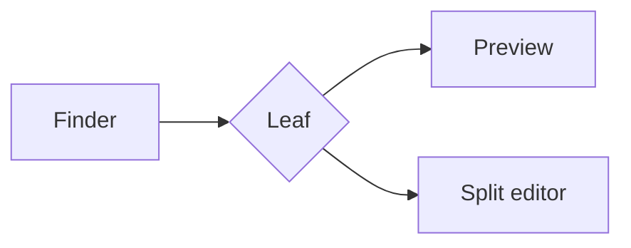

# Leaf

Instant Markdown preview with a **split-screen editor**, built on `vue-stream-markdown`.

## Why

- Opens straight from Finder, no browser tab
- Typewriter or instant rendering, your choice
- Everything renders offline: shiki, KaTeX and mermaid are bundled

## Code

```ts
export function greet(name: string): string {
  return `Hello, ${name}`
}
```

## Table

| Feature | Preview | Split |
| --- | :---: | ---: |
| Live reload | yes | yes |
| Sync scroll | n/a | yes |
| Typing animation | yes | skipped |

## Math

Inline $e^{i\pi} + 1 = 0$ and a block:

$$
\int_{-\infty}^{\infty} e^{-x^2}\,dx = \sqrt{\pi}
$$

## Diagram



## Tasks

- [x] File association
- [x] Drag and drop
- [ ] Custom app icon

> Footnote support too.[^1]

[^1]: Rendered by comark under the hood.
