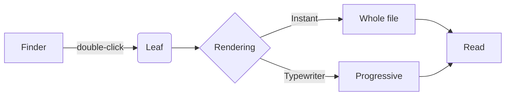

# Leaf

Open a Markdown file from Finder. It renders. That is the whole idea.

Everything below is rendered by the same engine that drives streaming LLM
output, bundled offline: **shiki** for code, **KaTeX** for math, **mermaid**
for diagrams. No network, no CDN, no spinner.

---

## Code

```ts
export function render(doc: Document): Promise<Html> {
  const engine = createEngine({ code: shiki, math: katex, diagram: mermaid })
  return engine.render(doc.content)
}
```

## Math

The Gaussian integral, inline as $\int_{-\infty}^{\infty} e^{-x^2}dx = \sqrt{\pi}$,
and as a block:

$$
\hat{f}(\xi) = \int_{-\infty}^{\infty} f(x)\, e^{-2\pi i x \xi}\, dx
$$

## Diagrams



## The rest of Markdown

> Blockquotes, tables, task lists and footnotes all work.

| Shortcut | Does |
| --- | --- |
| `⌘B` | File tree |
| `⌘E` | Split editor |
| `⌘S` | Save |
| `⌘,` | Settings |

- [x] Renders offline
- [x] Remembers your scroll position per file
- [ ] Reads the document out loud

Press `⌘B` to open the tree on the left, then walk through the other files
in this folder.
