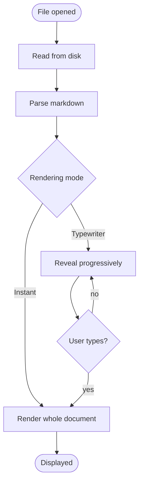
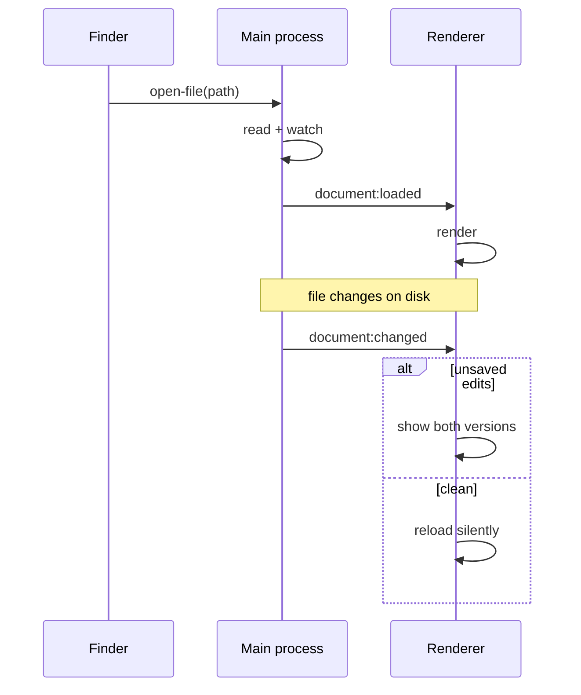
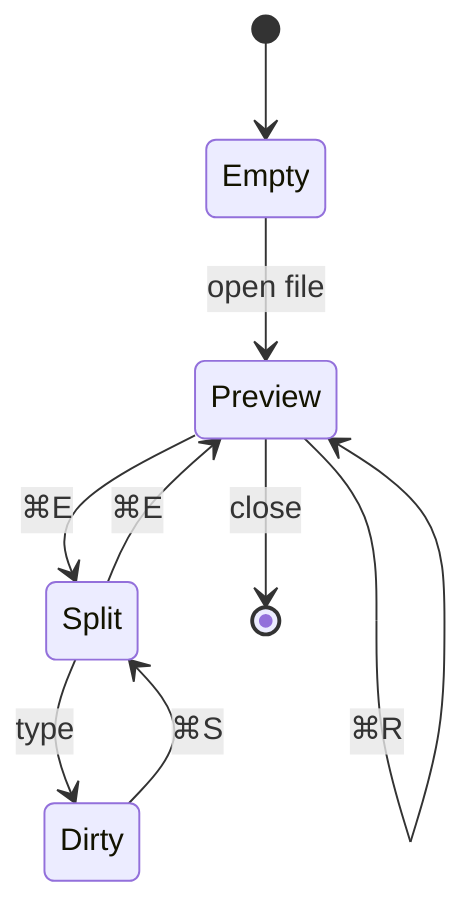
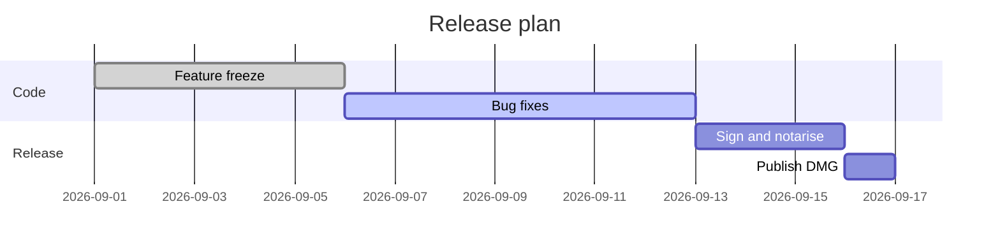
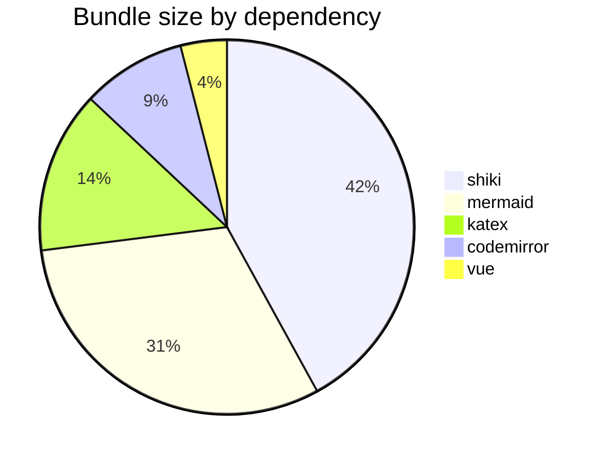
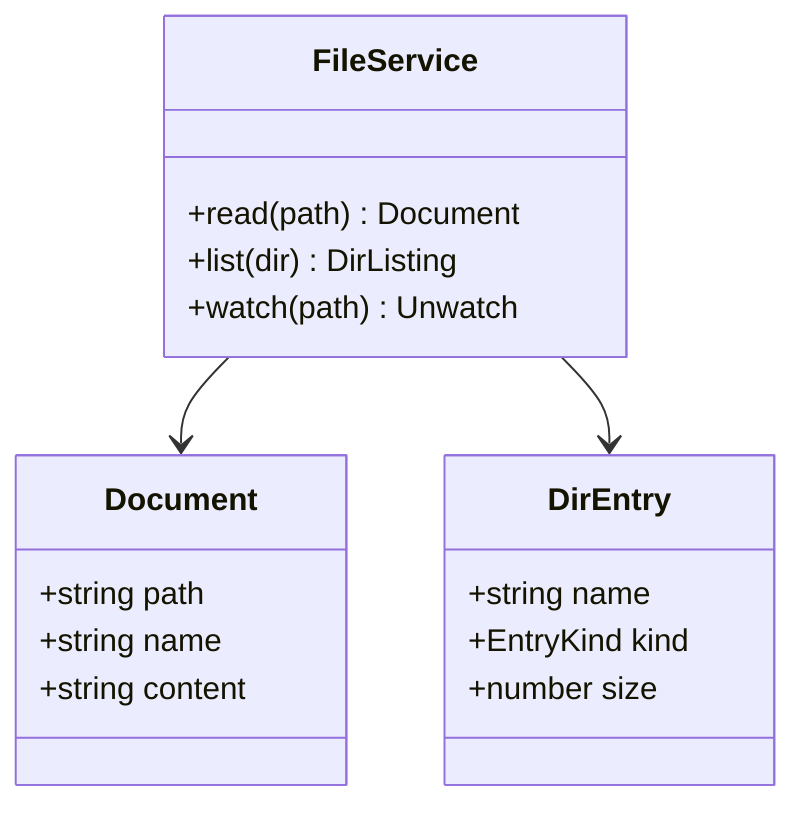

# Diagrams

Mermaid, rendered locally.

## Flowchart

```mermaid
flowchart TD
    Start([File opened]) --> Read[Read from disk]
    Read --> Parse[Parse markdown]
    Parse --> Mode{Rendering mode}
    Mode -->|Instant| Full[Render whole document]
    Mode -->|Typewriter| Stream[Reveal progressively]
    Stream --> Typing{User types?}
    Typing -->|yes| Full
    Typing -->|no| Stream
    Full --> Done([Displayed])
```

## Sequence

```mermaid
sequenceDiagram
    participant F as Finder
    participant M as Main process
    participant R as Renderer
    F->>M: open-file(path)
    M->>M: read + watch
    M->>R: document:loaded
    R->>R: render
    Note over M,R: file changes on disk
    M->>R: document:changed
    alt unsaved edits
        R->>R: show both versions
    else clean
        R->>R: reload silently
    end
```

## State

```mermaid
stateDiagram-v2
    [*] --> Empty
    Empty --> Preview: open file
    Preview --> Split: ⌘E
    Split --> Preview: ⌘E
    Split --> Dirty: type
    Dirty --> Split: ⌘S
    Preview --> Preview: ⌘R
    Preview --> [*]: close
```

## Gantt

```mermaid
gantt
    title Release plan
    dateFormat YYYY-MM-DD
    section Code
    Feature freeze      :done,    a1, 2026-09-01, 5d
    Bug fixes           :active,  a2, 2026-09-06, 7d
    section Release
    Sign and notarise   :         b1, after a2, 3d
    Publish DMG         :         b2, after b1, 1d
```

## Pie

```mermaid
pie title Bundle size by dependency
    "shiki" : 42
    "mermaid" : 31
    "katex" : 14
    "codemirror" : 9
    "vue" : 4
```

## Class

```mermaid
classDiagram
    class Document {
        +string path
        +string name
        +string content
    }
    class DirEntry {
        +string name
        +EntryKind kind
        +number size
    }
    class FileService {
        +read(path) Document
        +list(dir) DirListing
        +watch(path) Unwatch
    }
    FileService --> Document
    FileService --> DirEntry
```
