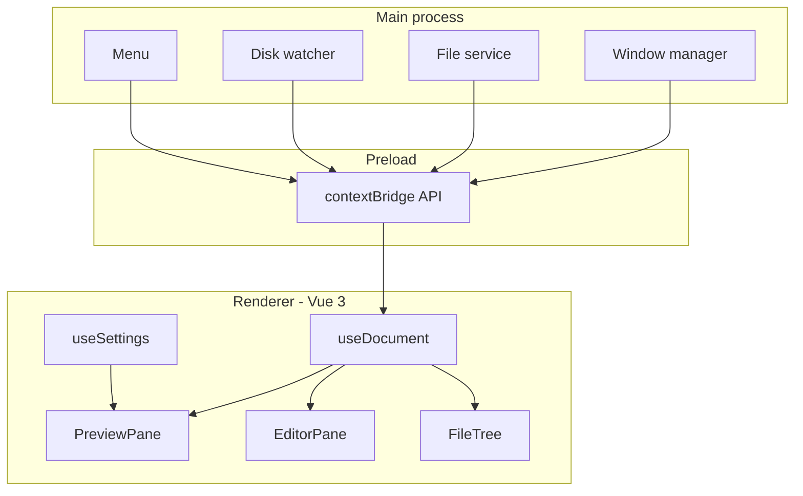

# Architecture

## Process split

| Layer | Owns |
| --- | --- |
| `src/main/` | windows, file IO, the disk watcher, the application menu |
| `src/preload/` | the one API object bridged into the renderer |
| `src/shared/` | types both sides agree on |
| `src/renderer/` | the Vue app: preview, editor, tree, settings |

## Invariants

- The renderer never touches `fs`.
- `src/shared/` imports nothing from either side.
- A document has exactly one owner window.
